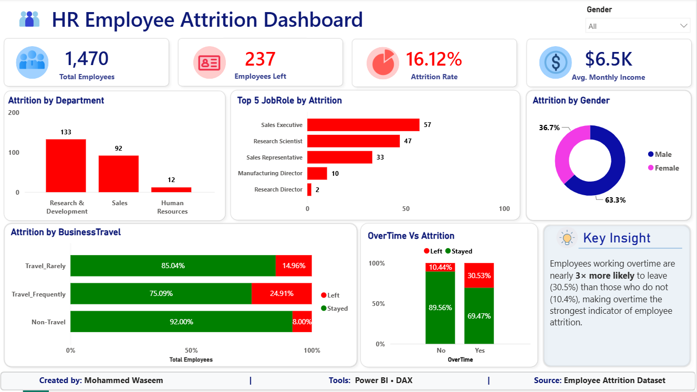

#  HR Employee Attrition Dashboard

##  Project Overview

This project presents an interactive HR Analytics Dashboard developed in **Power BI** to analyze employee attrition and identify the factors influencing employee turnover.

The dashboard enables HR teams and business stakeholders to monitor attrition trends, identify high-risk employee groups, and support data-driven retention strategies.

---

##  Objectives

- Analyze overall employee attrition
- Identify departments with the highest employee turnover
- Analyze attrition by job role
- Compare attrition based on overtime
- Analyze attrition across business travel categories
- Study gender-wise attrition
- Provide actionable business insights

---

##  Dashboard Preview



---

##  Key Performance Indicators

- Total Employees
- Employees Left
- Attrition Rate
- Average Monthly Income

---

##  Dashboard Visualizations

### 1. Attrition by Department

Shows departments with the highest employee exits.

---

### 2. Top 5 Job Roles by Attrition

Highlights job roles experiencing the highest turnover.

---

### 3. Overtime vs Attrition

Compares attrition between employees working overtime and those who do not.

---

### 4. Business Travel vs Attrition

Analyzes employee attrition based on business travel frequency.

---

### 5. Attrition by Gender

Displays the gender distribution of employee attrition.

---

### 6. Executive Insight

> Employees working overtime are nearly **3× more likely** to leave (30.5%) than employees who do not work overtime (10.4%), making overtime the strongest indicator of employee attrition.

---

## 🛠 Tools Used

- Microsoft Power BI
- DAX (Data Analysis Expressions)
- Power Query
- Microsoft Excel

---

##  DAX Measures Used

### Total Employees

```DAX
Total Employees = COUNTROWS('hr_analytics employees')
```

### Employees Left

```DAX
Employees Left =
CALCULATE(
    COUNTROWS('hr_analytics employees'),
    'hr_analytics employees'[Attrition] = "Yes"
)
```

### Attrition Rate

```DAX
Attrition Rate =
DIVIDE(
    'hr_analytics employees'[Employees Left],
    'hr_analytics employees'[Total Employees]
)
```

### Average Monthly Income

```DAX
Average Monthly Income =
AVERAGE('hr_analytics employees'[MonthlyIncome])
```

---

##  Business Insights

- Overall attrition rate is **16.12%**
- Employees working overtime are nearly **3× more likely** to leave.
- Research & Development records the highest employee attrition.
- Sales Executive is the most affected job role.
- Male employees account for the majority of employee attrition.

---

##  Dataset

HR Analytics Employee Attrition Dataset

---

##  Skills Demonstrated

- Data Cleaning
- Data Modeling
- DAX
- KPI Design
- Dashboard Design
- Business Intelligence
- Data Visualization
- HR Analytics

---

##  Author

**Mohammed Waseem**

- LinkedIn: *(www.linkedin.com/in/waseem1809)*
